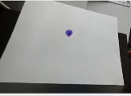
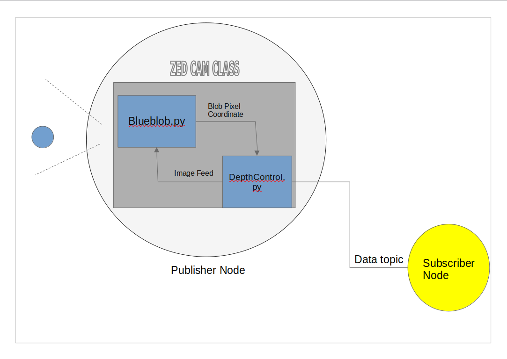

# VIP Documentation 


Goal: To give the reader a high level overview of the algorithms work flow within the context of a contrived example. 

### Think of this

Anyone who drives or has even seen someone drive knows the cardinal rules is "Never take your eyes of the road". When we drive we're scanning the road constantly to see when we have to make the next turn, if there's a stop light up ahead, etc. 

With that idea in mind ask yourself, how would a computer constantly monitor the road and know what to do? First it needs to be able to see the road, but computers don't have eyes. They just read binary data. 

Usually computers see the road by communicating with an external device such as a camera and taking data from that camera and using that data to make choices. 

This is the starting point for the tech stack. Currently we are using the ZED2i camera. Think of this camera as "the eyes" of the driver. Keep in mind we need to extract information from the camera. How do we do that? 

The Zed2i camera has its own API, which has a multitude of function for interfacing with the Zed. 

Go over the the function for getting different image output from the ZED 
Error checking from the ZED and obtaining Serial Number 
Go over how to extract data from different different image outputs 

After this we want to highlight the fact that we have a continuous stream of data. So we have these points now.

Lets revisit the analogy of a human driving a car. I see a stop sign coming up and my eyes are relaying that information to my brain. Then my brain starts to anticipate the timing on when I should stop. In order to come to a proper stop there are two major questions a driver ask themselves. Is that a stop sign, and how far a way am I from that sign. 

We once again ask the question, how does a self-driving car do this? To answer question 1 we need our camera to be able to tell if there is a stop sign present. Then we need to figure out how far away we are from that stop sign. 

### High Level Overview of Basic Obstacle Detection 

We’re going to use a simple form of object detection, blob detection. Essentially we are filtering out the object of interest based on its shape. For our simple example we are trying to detect a blue dot on a white piece of paper.
 

 
We are first going to tell our blob detector to focus on circular shapes. Then we can set a radius parameter to tell it whether we want to focus on big circles or small circles.
 
```
params = cv2.SimpleBlobDetector_Params()
 
# Filter by circularity
params.filterByCircularity = True
params.minCircularity = 0.2
```

From there we it will be able to detect that circle which is great! 


### High Level Overview of Distance Tracking 
2 ) How we take pixels from the zed and use that API to find the Euclidean distance. 

Now let’s hone in on working with our camera or choice, the Zed2i. Thankfully the camera has a Python API that’s installable, which allows us to just call a few functions to access image feed, point cloud feed, and depth map feed. 

```
# Parameters to get image,depth, and point cloud data
runtime = sl.RuntimeParameters()
image = sl.Mat() 
depth = sl.Mat()
point_cloud = sl.Mat()

cam.retrieve_image(image, sl.VIEW.LEFT)
cam.retrieve_measure(depth,sl.MEASURE.DEPTH)
cam.retrieve_measure(point_cloud,sl.MEASURE.XYZRGBA)

$ Examle of extracting invinzual xyz values from point cloud map 
x_p = pointCloudVal[0]
y_p = pointCloudVal[1]
z_p = pointCloudVal[2]

```

Dearth Maps and point Cloud Data may seem complicated. For the purpose of this example think of the depth map as a way of giving the Zed a sense of depth perception. We see the images as 2D but the Zed is able to use the depth map to determine how close every pixel in the image is relative to the camera. Point cloud data could be thought of as a way of discretizing  an image. We see a 2D image but the computer a actually sees a 2D array which represent the xy coordinate system So the Zed represents every pixel as a set of numbers in a 2D matrix. So we use the Euclidian Distance (https://www.mathsisfun.com/definitions/euclidean-algorithm.html) to calculate the distance between the a pixel that we choose and the location of the Zed in this xy space. Each xy point represents a pixel but it is also represented by a point cloud. 

### Combining the Two Scripts

Remember when we were able to detect that blue circle. That is great but remember our distance formula operates on pixels. While we’ve detected the circle we want to be a little bit more specific. We want to go from finding a blue circle to finding the pixel location of that blue circle. Then we can give our distance formula that pixel location. It will tell us the cameras distance from that location which by extension tells us how far away that blue dot is from my camera. 

```
x,y = blob_detection(cvImage)

err, pointCloudVal = point_cloud.get_value(x,y)

x_p = pointCloudVal[0]
y_p = pointCloudVal[1]
z_p = pointCloudVal[2]

#Find distance using Euclidean distance (in mm)
distance = math.sqrt(x_p * x_p +
         y_p * y_p +
         z_p * z_p)

 ```

At the bottom here this code is completely optional. This just displays the distance and whether her we have reached stop threshold on the image. I’m not going to go into how this code works but I will leave a link with an explanation()


### Next Steps 

We are able to detect that STOP sign and see how far away it is, this is great! Unfortinaly this camera can't control a whole autnomous vehicle but it was useful for giving us vital information about this object while driving. 

This camera interface is only one part of the whole system. So we need a way to pass the useful information that we were able to gather to other parts of the car. So how do we send this information over? Enter ROS 

While it may seem very complex the whole idea behind ROS can be explained with a simple aznalogy. Think of it like sending a text. I type my message in my phone and chose someone to send it to. Think of my camera as a person sending a text. The message it sends is all the useful information we've gathered. 

In ROS "lingo" the person sending the text is called the publisher. The text message we send it called a topic. The person receiving the text is called a subscriber. 


(There are more details about ROS but I encourage you to look at the wiki if you are interested in installing ROS and getting started https://docs.ros.org/en/iron/index.html)

We simply use the ROS libraries to create two separate python scripts. One script will instantiate the ZED class. This gives us access to the camera and will produce the distance between the ZED and our object of
interest. We will send this through a topic called "distance" of data type float. 

Next we will have a script that creates a subscriber node. It listens in on this "distance" message. From there we have this data and now we can do anything with it. We can preform calculations on this distance or we can see if the distance is within a certain threshold which tells us we should stop. 

### Summary 

To sum everything up I'm going to include a block diagram of this whole system. The main takeaway is, what was developed here is only a part of the whole system 



Stereo Labs Zed API Documentation: https://www.stereolabs.com/docs/video

  ROS Wiki Documentation: https://docs.ros.org/en/iron/index.html 
   
Open CV Documentation: https://docs.opencv.org/4.x/

Link to video demonstration: 


 

